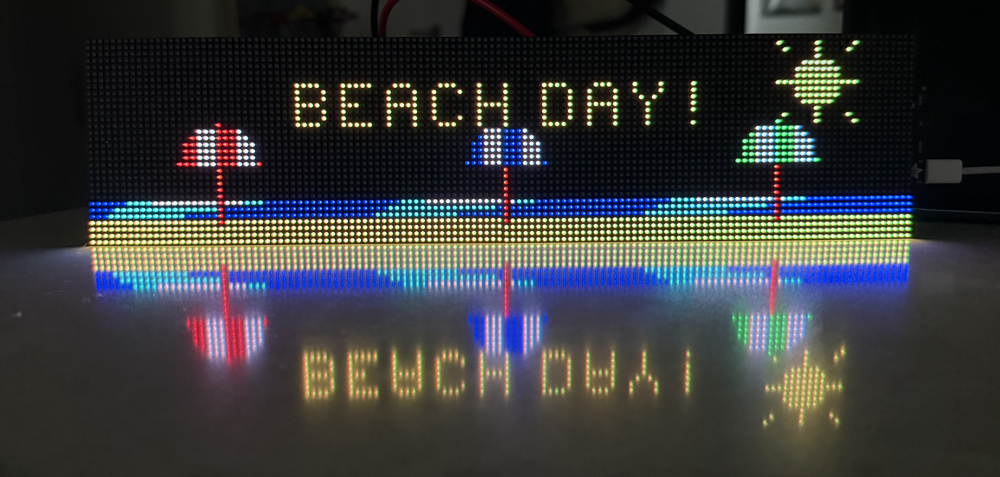
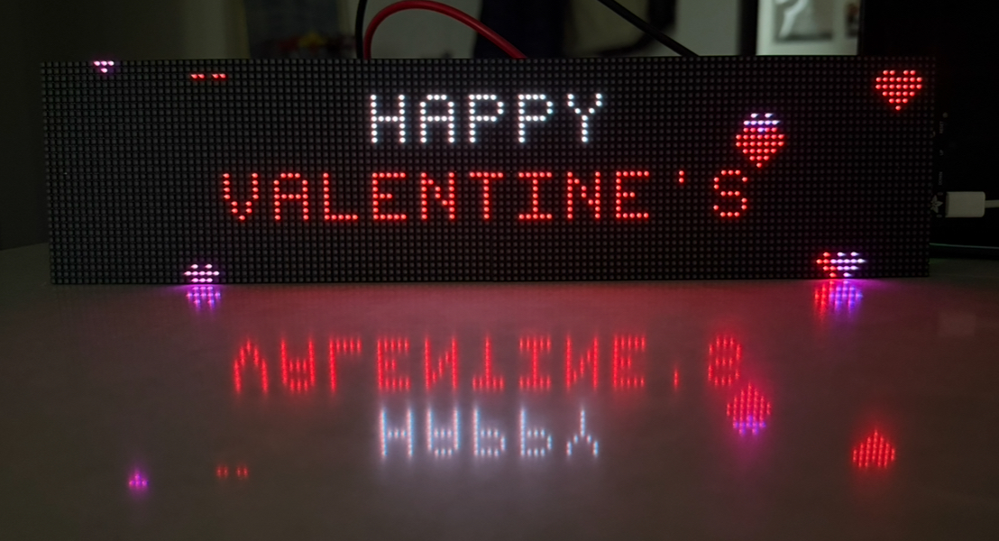
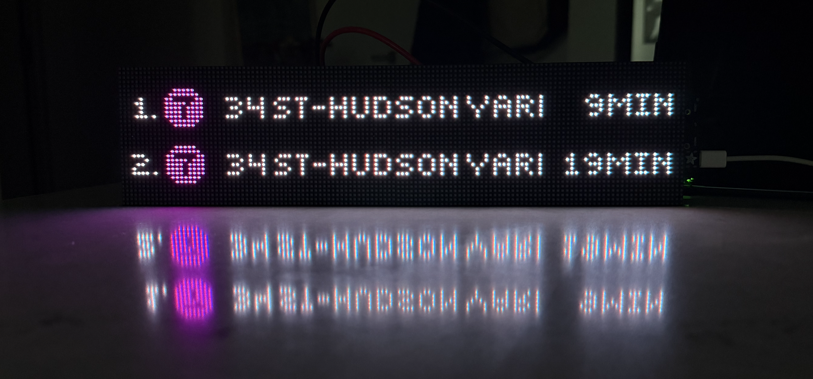
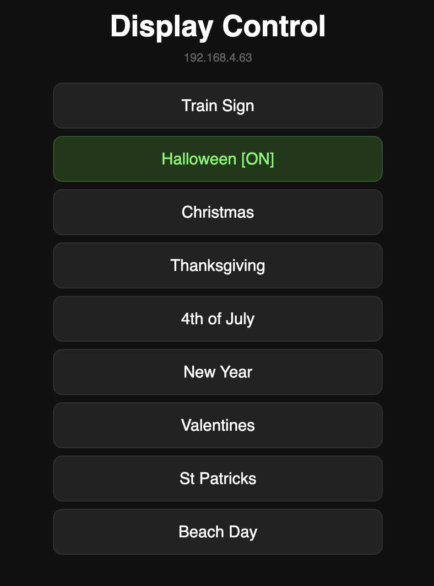

# 🚇 NYC Subway Tracker

Real-time NYC subway arrival display powered by an **Adafruit MatrixPortal S3** and two chained **64×32 HUB75 LED matrices** (128×32 total).


## Hardware

| Component | Qty | Link |
|-----------|-----|------|
| Adafruit MatrixPortal S3 | 1 | [adafruit.com/5778](https://www.adafruit.com/product/5778) |
| 64×32 RGB LED Matrix (HUB75, 4mm pitch) | 2 | [adafruit.com/2278](https://www.adafruit.com/product/2278) |
| 5V 4A+ Power Supply | 1 | [adafruit.com/1466](https://www.adafruit.com/product/1466) |
| HUB75 ribbon cable | 1 | (usually included with panels) |

### Wiring

1. Plug the MatrixPortal S3 directly into the **input** HUB75 connector of the first panel
2. Chain the second panel using a ribbon cable from **output** of panel 1 → **input** of panel 2
3. Power both panels (use a Y-splitter or separate power cables — each panel draws up to 4A at full white)
4. Connect USB-C for data/programming

## Software Setup

### 1. Install CircuitPython

Download the latest CircuitPython (≥8.2.1) for the MatrixPortal S3:
- https://circuitpython.org/board/adafruit_matrixportal_s3/

Double-click the **Reset** button to enter bootloader mode (NeoPixel turns green), then drag the `.uf2` file onto the `MATRXS3BOOT` drive.

### 2. Install Required Libraries

Download the [Adafruit CircuitPython Library Bundle](https://circuitpython.org/libraries) and copy these to the `lib/` folder on your `CIRCUITPY` drive:

```
lib/
  adafruit_requests.mpy
  adafruit_connection_manager.mpy
```

### 3. Deploy Project Files

Copy these files to the **root** of your `CIRCUITPY` drive:

```
CIRCUITPY/
├── code.py              # Main entry point (runs on boot)
├── font_data.py         # Bitmap font definitions & line colors
├── mta_feed.py          # MTA GTFS-RT feed parser
├── train_sign.py        # Display rendering engine
├── settings.toml        # Wi-Fi credentials & station config
└── lib/
    ├── adafruit_requests.mpy
    └── adafruit_connection_manager.mpy
```

### 4. Configure

Edit `settings.toml` on the CIRCUITPY drive:

```toml
CIRCUITPY_WIFI_SSID     = "YourWiFiName"
CIRCUITPY_WIFI_PASSWORD = "YourWiFiPassword"

# Comma-separated stop configs: stop_id:line:direction
# See "Finding Your Stop ID" below
MTA_STOPS = "721:7:N,G24:G:S"

# Refresh interval in seconds
MTA_REFRESH_INTERVAL = "30"

# Number of rows to display (max 2 for 128x32)
MTA_NUM_ROWS = "2"
```

The `MTA_STOPS` format is `stop_id:line:direction` where:
- **stop_id** — GTFS stop ID (e.g. `721`, `G24`)
- **line** — subway line letter/number to filter (e.g. `7`, `G`). Omit to match any line at that stop.
- **direction** — `N` (northbound/Queens/Bronx-bound) or `S` (southbound/Brooklyn-bound). Omit for both.

### Finding Your Stop ID

Each subway station has a GTFS stop ID. The direction suffix (`N` or `S`) is added automatically — you only need the base ID (e.g. `721`, not `721N`).

#### Method 1: Download the MTA GTFS Static Feed

1. Download the static feed: [google_transit.zip](http://web.mta.info/developers/data/nyct/subway/google_transit.zip)
2. Unzip and open `stops.txt`
3. Search for your station name — the `stop_id` column has the ID you need
4. Rows with `location_type=1` are the parent stations (use that ID)

```bash
# Quick lookup from the terminal:
curl -sL http://web.mta.info/developers/data/nyct/subway/google_transit.zip -o /tmp/gtfs.zip
unzip -o /tmp/gtfs.zip stops.txt -d /tmp/gtfs
grep -i "your station name" /tmp/gtfs/stops.txt
```

#### Method 2: MTA Subway Stations Dataset

Browse the [MTA Subway Stations](https://data.ny.gov/Transportation/MTA-Subway-Stations/39hk-dx4f) dataset on NY Open Data — the `GTFS Stop ID` column has the IDs.

#### Common Stop IDs

| Station | Stop ID | Lines |
|---------|---------|-------|
| Vernon Blvd-Jackson Av | 721 | 7 |
| 21 St (Queensbridge) | G24 | G |
| Court Sq | G22 | G, 7 |
| Times Sq-42 St | 725 | 1,2,3,7,N,Q,R,W,S |
| Union Sq-14 St | 635 | 4,5,6,L,N,Q,R,W |
| Atlantic Ave | 617 | 2,3,4,5,B,D,N,Q,R |
| Jay St-MetroTech | A41 | A,C,F,R |
| Bedford-Nostrand Avs | G33 | G |
| Hoyt-Schermerhorn Sts | A42 | A,C,G |

#### Realtime Feed Groups

Each line's arrivals come from a specific feed. The code handles this automatically, but for reference:

| Feed | Lines |
|------|-------|
| `gtfs` | 1, 2, 3, 4, 5, 6, 7 |
| `gtfs-ace` | A, C, E |
| `gtfs-bdfm` | B, D, F, M |
| `gtfs-g` | G |
| `gtfs-jz` | J, Z |
| `gtfs-l` | L |
| `gtfs-nqrw` | N, Q, R, W |
| `gtfs-si` | SI |

> **Note:** Some stops share IDs across lines (e.g. `A42` appears in both ACE and G feeds). The `:line` filter in your config ensures you only see the line you want.

#### Direction Reference

- **N (Northbound)** — generally toward Manhattan, Uptown, Queens, or the Bronx
- **S (Southbound)** — generally toward Brooklyn, Downtown, or Coney Island

Check the [MTA map](https://map.mta.info/) if you're unsure which direction you need.

## How It Works

```
code.py (main loop)
  ├── Connects to Wi-Fi
  ├── Fetches MTA GTFS-RT protobuf feeds (no API key needed)
  │   └── mta_feed.py parses raw protobuf to extract arrivals
  ├── Renders display using bitmap fonts
  │   └── train_sign.py draws circles, text, times
  │       └── font_data.py provides 5×7 and 5×5 bitmap glyphs
  └── Refreshes every 30 seconds
```

### Display Layout (128×32)

```
┌──────────────────────────────────────────────────────┐
│ (⑦) 34 St-Hudson                             3min   │  Row 1
│──────────────────────────────────────────────────────│  Divider
│ (Ⓖ) Church Ave                               5min   │  Row 2
└──────────────────────────────────────────────────────┘
```

Each row shows:
- **Colored circle** with the line letter/number (official MTA colors)
- **Destination** name
- **Arrival time** in minutes (right-aligned)

## Holiday Modes

The display includes 8 animated holiday modes, all built in and switchable instantly via the [web interface](#mode-switching-via-web-interface). No file swapping or reboot needed — just tap a button. Holiday animations run entirely offline (no Wi-Fi needed after the initial connection).

| Holiday | Mode File | Animation |
|---------|-----------|-----------|
| 🏖️ Beach Day | `modes/beachday.py` | Scrolling ocean waves, sun, sand, and colorful beach umbrellas |
| 🎄 Christmas | `modes/christmas.py` | Falling snowflakes and Christmas trees with blinking lights |
| 🎃 Halloween | `modes/halloween.py` | Bobbing spiders on web threads and animated bats |
| 🇺🇸 4th of July | `modes/july4th.py` | Red, white, and blue fireworks |
| 🎆 New Year | `modes/newyear.py` | Multi-color fireworks with 3-color particle trails |
| ☘️ St. Patrick's Day | `modes/stpatricks.py` | Floating shamrocks in multiple shades of green |
| 🍂 Thanksgiving | `modes/thanksgiving.py` | Falling autumn leaves (maple, oak, aspen, and more) in fall colors |
| 💕 Valentine's Day | `modes/valentines.py` | Hearts floating upward in pinks and reds |

Each banner displays a centered holiday greeting with animated elements around the text.

| | | |
|:---:|:---:|:---:|
|  |  |  |
| Beach Day | Christmas | Halloween |
|  |  |  |
| 4th of July | New Year | St. Patrick's Day |
|  |  |  |
| Thanksgiving | Valentine's Day | Train Sign |

### Mode Switching via Web Interface

Once connected to Wi-Fi, the display runs a built-in web server for switching modes on the fly:

- **http://display.local** (via mDNS)
- **http://\<board-ip\>** (e.g. `http://192.168.4.63`)



Tap any button to instantly switch between the live train sign and holiday animations — no reboot needed.

> **Tip:** If `display.local` doesn't resolve, use the board's IP address (printed to the serial console on boot).

### Loading Screen


Shown briefly on boot while connecting to Wi-Fi and fetching the first batch of arrivals.

## Development

The `TrainSign.ipynb` notebook is a Pillow-based mock of the LED display for prototyping the layout without hardware. Run it to preview what the display looks like.

The `TrainSign/test/` folder contains standalone test files that run on the hardware without Wi-Fi:
- `code.py` — scrolling display test with sample data
- `no_wifi_screen.py` — preview of the "No WiFi" error screen

## Debugging via Serial Console

The MatrixPortal S3 outputs debug logs over USB serial. You can connect to it to see real-time status, errors, and arrival data.

### 1. Find the serial port

```bash
ls /dev/tty.usb*
```

You should see something like `/dev/tty.usbmodemXXXXX`. The exact name depends on your board.

### 2. Connect with `screen`

```bash
screen /dev/tty.usbmodem* 115200
```

Replace `*` with the full device name if multiple USB devices are connected.

### 3. What you'll see

```
Connecting to WiFi...
WiFi connected!
Fetching arrivals...
Row 0: 7 → 34 St-Hudson Yards  3min
Row 1: G → Church Av           8min
```

### 4. Disconnect

Press `Ctrl-A` then `K`, then `Y` to confirm.

> **Tip:** If the serial port doesn't appear, try a different USB-C cable — some cables are charge-only and don't carry data. Also, the port disappears briefly when the board resets.

> **Tip:** You can also press `Ctrl-C` in the serial console to drop into the CircuitPython REPL, and `Ctrl-D` to soft-reboot the board.

## MTA Data

This project uses the [MTA GTFS-Realtime feeds](https://api.mta.info/) which are **free and require no API key**. Data is provided in Protocol Buffer format; the `mta_feed.py` module includes a minimal protobuf parser written in pure Python/CircuitPython.

## License

See [LICENSE](LICENSE) for details.
